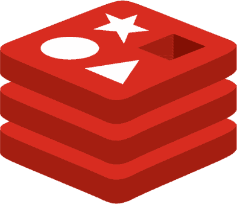
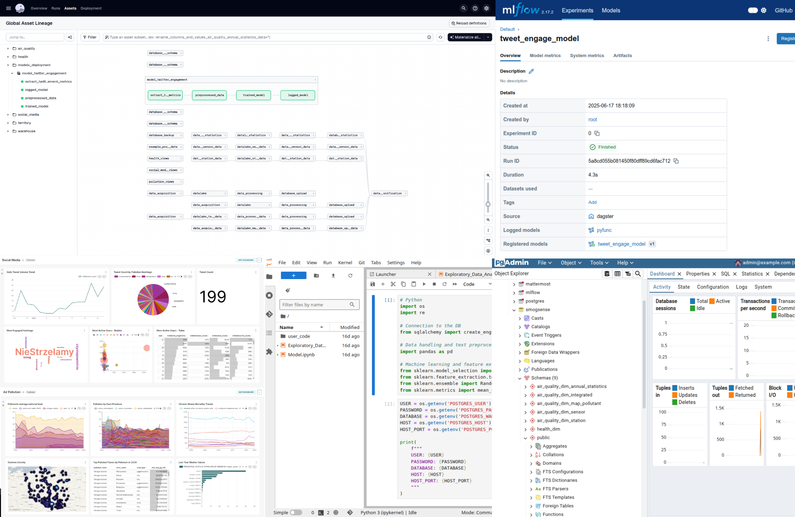

# 🌫️🔧 SmogSense

A modular `data platform` integrating for `end-to-end analytics`, `data pipelines` orchestration, `machine learning models registry` and observability in local open-source environments.<br>

The example setup for the commercial cloud is here:<br>[./server_deployment/README](./server_deployment/README)

Each service is deployed via  [`docker`](https://www.docker.com/):

**📊 Analytics:**
-  [pgAdmin:](https://www.pgadmin.org)<br>*PostgreSQL database web management tool.*<br>*`http://localhost:5050`*
-  [Superset:](https://superset.apache.org)<br>*Data visualization and dashboarding platform.*<br>*`http://localhost:8090`*
*

**🧪 Data Science:**
-  [JupyterLab:](https://jupyter.org)<br>*Interactive data analysis notebooks.*<br>*`http://localhost:8888`*


**📈 Monitoring Resources:**<br>
*[Documentation](https://github.com/Luk-kar/dockprom-and-logs)*
-  [Grafana:](https://grafana.com/)<br>*Visualize metrics and build dashboards.*<br>*`http://localhost:3000`*

-  [Prometheus:](https://prometheus.io/)<br>*Metrics collection and time-series storage.*<br>
-  [Loki:](https://grafana.com/oss/loki/)<br>*Centralized log aggregation and querying.*<br>
-  [Alertmanager:](https://prometheus.io/docs/alerting/latest/alertmanager/)<br>*Manage and route monitoring alerts.*<br>
-  [Promtail:](https://grafana.com/docs/loki/latest/send-data/promtail/)<br>*Collect and forward container logs.*<br>
-  [Caddy:](https://caddyserver.com/)<br>*Secure reverse proxy and gateway.*<br>

**🔗 Orchestration Data Pipelines:**
-  [Dagster:](https://dagster.io/)<br>*Orchestrate and schedule data pipelines.*<br>*`http://localhost:5000`*

**🗄️ Database:**
-  [PostgreSQL:](https://www.postgresql.org/)<br>*Relational database for structured data.*<br>*`via client, not web: localhost:5432`*
  
**🪣 Unstructured Data Storage / Datalake**:
-  [MinIO:](https://min.io/)<br>*S3-compatible object data storage.*<br>
  - *API: `http://localhost:9000`*
  - *Web: `http://localhost:9001`*
  
**🤖 Machine Learning Models Registry:**
-  [MLflow:](https://mlflow.org/)<br>*Track and manage ML models.*<br>*`http://localhost:5005`*

**⚡ In-Memory, Key-Value, Database:**
-  [Redis:](https://redis.io/)<br>*Fast in-memory cache and queue.*<br>

**💬 (Optional) Team Collaboration:**
-  [Mattermost:](https://mattermost.com/)<br>*Team chat and collaboration platform.*<br>*`http://localhost:8065`*

---



*e.g. of the most important services:<br>dagster, superset, pgadmin, minio, mlflow, jupyterlab:*

---
For cloud deployments, the system is provisioned and configured using  Terraform (`infrastructure as code`) and  Ansible (`configuration management automation`) to automate virtual machine setup, service installation, and network security on  `Azure` cloud.

While the project is intended to run as a proof of concept on a single machine, services can be distributed across multiple machines by adapting the implementation to use  `Docker Swarm` or  `Kubernetes`.


## 📦 Requirements

For services deployment:
-   [`docker-compose.yml`](docker-compose.yml)
  
For cloud deployment:
-  `Terraform`
-   `Ansible`
-  `Azure` *(account or any other provider)*

Project's scripts were run on  Ubuntu  Linux

## ⚙️🔨 Installation and Usage

**A.** For 🖥️ local use:<br>
   1. **Clone the repository**
       ```bash
       git clone hhttps://github.com/Luk-kar/SmogSense.git
       cd SmogSense
       ```

   2. **Configure environment variables**  
      Copy the example file and edit it with your credentials and model settings: 
      ```bash
      cp .env.example .env
      # Open .env in your editor and adjust passwords, users or ports etc.
      ```
   3. **Start services with Docker Compose**  
      ```bash
      docker-compose up --build -d
      ```
      - **PostgreSQL** will initialize the specified databases.
      - **pgAdmin** will be available for database management.
      - **MinIO** will serve as S3-compatible object storage.
      - **Superset** will be available for data visualization.
      - **JupyterLab** will be available for interactive notebooks.
      - **MLflow** will be available for model management.
      - **Redis** will be available for caching and queues.
      - **Dagster** will orchestrate data pipelines.
      - **Monitoring stack** (Prometheus, Grafana, Loki, Alertmanager, Promtail, cAdvisor, Node Exporter, Pushgateway, Caddy) will be available for observability.
      - **(Optional) Mattermost** will be available for team collaboration.
   4. **Verify everything is running**  
      ```bash
      docker ps
      # You should see:
       # smogsense_postgres, smogsense_pgadmin, smogsense_minio... etc
      ```

   5. **Access the application**  
      Open your browser and navigate to   `Dagster` webserver:  
      ```
      http://localhost:5000
      ```
       And run the example tasks:
       - `upload_example_project_data_to_minio`
       - `restore_example_project_database`

**B.** For ☁️ cloud use:<br>
[server_deployment/README.md](server_deployment/README.md)

##  Data Pipeline

## 🔧 Configuration

All settings are loaded from the [`.env`](.env.example) file, which contains environment variables organized by service. **Important security considerations**:
- **Production warning**: Avoid storing sensitive data in environment variables. Use a dedicated secrets management system instead.
- **Security tags**:
  - `#SECRECTS`: Variables requiring secure handling (passwords, API keys)
  - `#WARNING`: Critical configuration needing attention

## ✅ Testing
Testing is automated using shell scripts and Python modules, with dedicated test suites for data acquisition features such as air quality and health data. 

Test files are organized by functionality, and you can run all tests at once or target specific modules using the provided scripts.

```sh
tests/run_tests_data_air_quality.sh
```
## 💡 Notes

## 📜 License
This project is licensed under the MIT License. See the [LICENSE](LICENSE) file for more details.