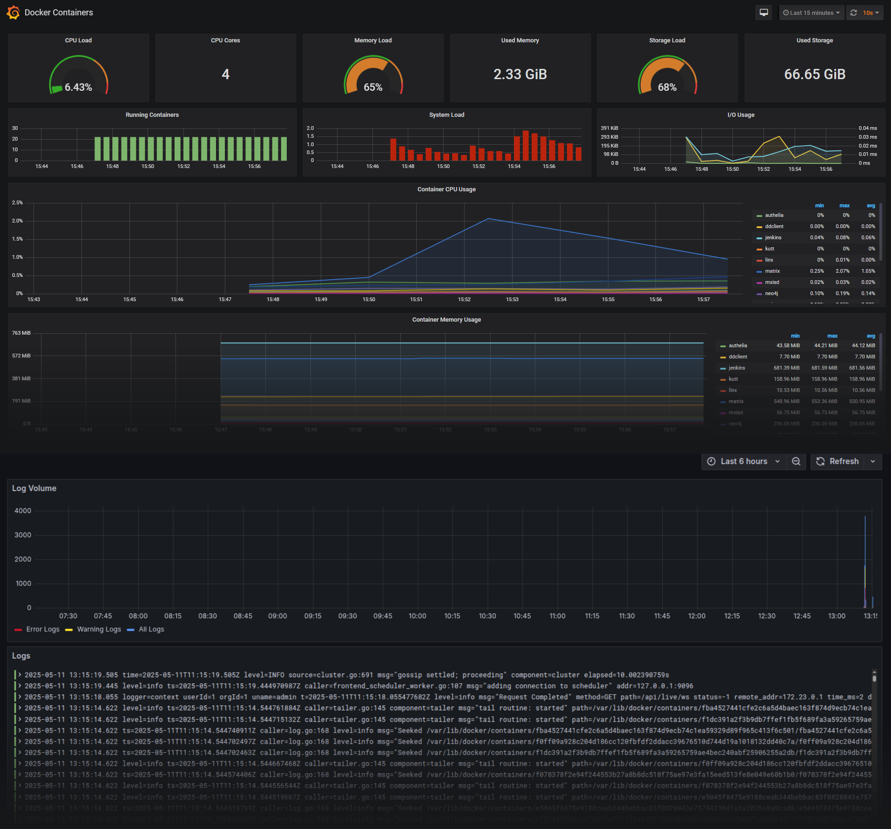
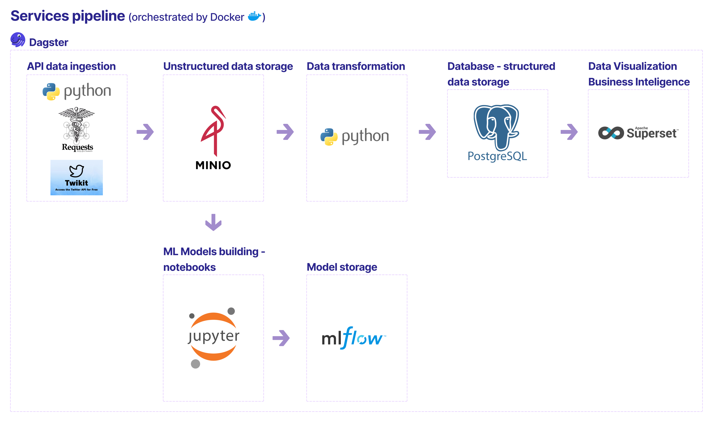

# 🌫️🔧 SmogSense

A modular `data platform` for `end-to-end analytics`, `data pipeline orchestration`, `machine learning model registry` in local open-source environments or for commercial cloud setup.

The project, as an example, used [public air-quality data](https://github.com/Luk-kar/smogsense-data).

## 📸 System Overview
**Data Platform Architecture:**  


**Resource Monitoring:**  


**Key Services:**  
Dagster, Superset, pgAdmin, MinIO, MLflow, JupyterLab, Grafana

## 🛠️ Service Deployment
Services are deployed via  [`Docker`](https://www.docker.com/):


**Analytics:**
-  [pgAdmin:](https://www.pgadmin.org)<br>*PostgreSQL database web management tool.*<br>[*`http://localhost:5050`*](http://localhost:5050)
-  [Superset:](https://superset.apache.org)<br>*Data visualization and dashboarding platform.*<br>[*`http://localhost:8090`*](http://localhost:8090)

**Data Science:**
-  [JupyterLab:](https://jupyter.org)<br>*Interactive data analysis notebooks.*<br>[*`http://localhost:8888`*](http://localhost:8888)


**Monitoring Resources:**<br>
*[Documentation.](https://github.com/Luk-kar/dockprom-and-logs)*
-  [Grafana:](https://grafana.com/)<br>*Visualize metrics and build dashboards.*<br>[*`http://localhost:3000`*](http://localhost:3000)

-  [Prometheus:](https://prometheus.io/)<br>*Metrics collection and time-series storage.*<br>
-  [Loki:](https://grafana.com/oss/loki/)<br>*Centralized log aggregation and querying.*<br>
-  [Alertmanager:](https://prometheus.io/docs/alerting/latest/alertmanager/)<br>*Manage and route monitoring alerts.*<br>
-  [Promtail:](https://grafana.com/docs/loki/latest/send-data/promtail/)<br>*Collect and forward container logs.*<br>
-  [Caddy:](https://caddyserver.com/)<br>*Secure reverse proxy and gateway.*<br>

**Orchestration Data Pipelines:**
-  [Dagster:](https://dagster.io/)<br>*Orchestrate and schedule data pipelines.*<br>[*`http://localhost:5000`*](http://localhost:5000)

**Database:**
-  [PostgreSQL:](https://www.postgresql.org/)<br>*Relational database for structured data.*<br>*`via client, not web: localhost:5432`*
  
**Unstructured Data Storage / Datalake**:
-  [MinIO:](https://min.io/)<br>*S3-compatible object data storage.*<br>
  - *API: `http://localhost:9000`*
  - *Web: [`http://localhost:9001`](http://localhost:9001)*
  
**Machine Learning Models Registry:**
-  [MLflow:](https://mlflow.org/)<br>*Track and manage ML models.*<br>[*`http://localhost:5005`*](http://localhost:5005)

**In-Memory, Key-Value, Database:**
-  [Redis:](https://redis.io/)<br>*Fast in-memory cache and queue.*<br>

**(Optional) Team Collaboration:**
-  [Mattermost:](https://mattermost.com/)<br>*Team chat and collaboration platform.*<br>[*`http://localhost:8065`*](http://localhost:8065)

## ☁️ Cloud Deployment
For cloud deployments, provisioning uses:
-  [Terraform](https://www.terraform.io/)  
  Infrastructure as code
-  [Ansible](https://www.ansible.com/)  
  Configuration management automation
-  [Azure](https://azure.microsoft.com/)  
  Cloud provider

## 📦 Requirements
For Services Deployment:
-  [docker-compose.yml](docker-compose.yml)

For Cloud Deployment:
-  [Terraform](https://www.terraform.io/)
-  [Ansible](https://www.ansible.com/)
-  [Azure](https://azure.microsoft.com/) (or alternative provider)

Tested Environment: 
 [Ubuntu](https://ubuntu.com/)  [Linux](https://www.youtube.com/watch?v=rrB13utjYV4)

## ⚙️🔨 Installation and Usage

### For local use
   1. Clone the repository
       ```bash
       git clone hhttps://github.com/Luk-kar/SmogSense.git
       cd SmogSense
       ```

   2. Configure environment variables

      ```bash
      cp .env.example .env
      # Open .env in your editor and adjust passwords, users or ports etc.
      ```
   3. Start services with Docker Compose  
      ```bash
      docker-compose up --build -d
      ```
      ---

   4. Verify everything is running
      ```bash
      docker ps
      # You should see:
       # smogsense_postgres, smogsense_pgadmin, smogsense_minio... etc
      ```

   5. Access the application
      Open  Dagster at:  
      http://localhost:5000

       Run example tasks:
       - upload_example_project_data_to_minio
       - restore_example_project_database
   6. Troubleshooting<br>
   Check asset logs for service issues
  
   7. Stop all services
      ```bash
      docker compose stop
      ```
   8. Remove all services from the machine
      ```bash
      docker compose down
      ```
### ☁️ Cloud Deployment
See [server_deployment/README.md](server_deployment/README.md)

##  Data Pipeline
### 🌐 Data Sources
- [GIOS API](https://powietrze.gios.gov.pl/pjp/content/api)  
Air quality data (stations, measurements, AQI)
- [Statistical API (GUS BDL)](https://bdl.stat.gov.pl/bdl/start)  
Health and demographic statistics
- [Custom JSON Endpoint](https://gist.githubusercontent.com/Luk-kar/3aefd3f77d288ada85b5f44422b711d8/raw/b0793391ab0478e0d92052d204e7af493a7ecc92/poland_woj.json)  
Geospatial province data
- [Twitter (X) API](https://twikit.readthedocs.io/en/latest/twikit.html)  
Social media data (rate-limited)
  
### 🔄 Pipeline Architecture



### ✅ Data Quality

Assets include automated [Dagster checks](https://dagster.io/blog/dagster-asset-checks) for validation.  

Example validation logic: 
[air_quality/assets/annual_statistics/validations](src/orchestration/dagster/my_project/air_quality/assets/annual_statistics/validations)

### 🏗️ Dagster services setup

See [README](src/orchestration/dagster/README)

## 🔧 Configuration

**Security Notes:**  
- ⚠️ Avoid storing secrets in .env for production - use dedicated secrets management
- Security tags in [.env](.env):
  - `#SECRETS`: Passwords/API keys requiring secure handling
  - `#WARNING`: Critical configuration needing attention

## ✅ Testing
Automated tests for data acquisition features: 

```sh
tests/run_tests_data_air_quality.sh
```
or
```sh
tests/run_tests_all.sh
```
## 💡 Architectural Insight
1. Implementing a **mapping table** is more efficient than repeatedly dropping/recreating tables to unify schemas from disparate sources.

   Advantages:
   - Schema Preservation: Maintains original source structures
   - Data Integrity: Avoids destructive operations
   - Maintainability: Simplifies schema evolution
   - Performance: Enables incremental updates without redefining foreign keys

   This pattern is particularly valuable in ETL pipelines with independently changing source schemas.

2. Superset dashboard exports may encounter compatibility issues when imported on different machines.

## 🧩 Further Possible Development
### Jenkins Integration
Integrate  [Jenkins](https://www.jenkins.io/) for CI/CD automation.

**Workflow:**
1. Code Commit: Changes pushed to repo
2. Build Trigger: Jenkins detects changes
3. Test Execution:  
   *Uses development data environments (MinIO/PostgreSQL) to protect production data*
4. Result Reporting: Archived logs and reports
5. Deployment:  
   *Development: Uses dev data environments  
   Production: Moves tested pipelines to production*

**Benefits:**
- Automated testing on commit
- Pipeline-as-code via `Jenkinsfile`
- Build/test reporting and alerts
- Plugin ecosystem integration

## 📜 License
MIT License - See [LICENSE](LICENSE)
