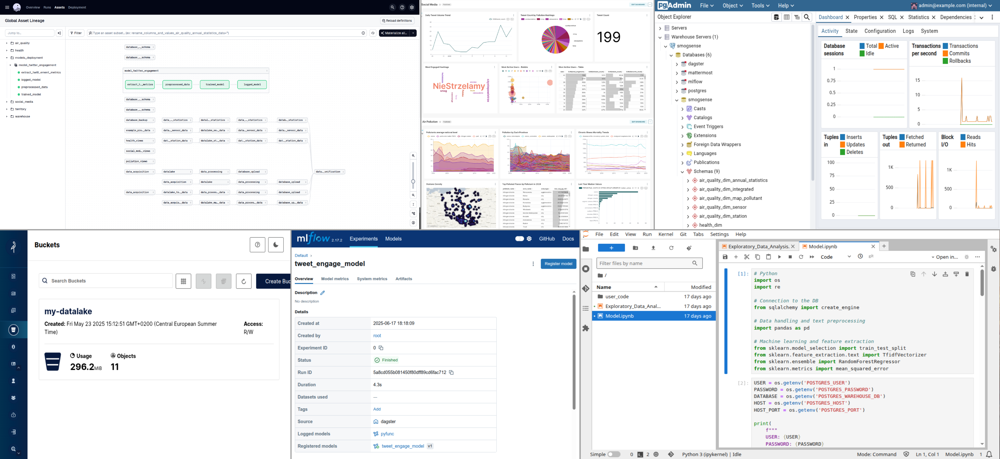

# 🌫️🔧 SmogSense

A modular data platform integrating for end-to-end analytics, data pipelines orchestration, machine learning models registry and observability in local open-source environments. 
The example setup for the commercial cloud is here: [./server_deployment/README](./server_deployment/README)

Each service is deployed via  [`docker`](https://www.docker.com/):

**📊 Analytics:**
-  [pgAdmin:](https://www.pgadmin.org) *PostgreSQL database web management tool.*
-  [Superset:](https://superset.apache.org) *Data visualization and dashboarding platform.*

**🧪 Data Science:**
-  [JupyterLab:](https://jupyter.org) *Interactive data analysis notebooks.*

**📈 Monitoring Resources:** 
*[Documentation](https://github.com/Luk-kar/dockprom-and-logs)*
-  [Prometheus:](https://prometheus.io/) *Metrics collection and time-series storage.*
-  [Grafana:](https://grafana.com/) *Visualize metrics and build dashboards.*
-  [Loki:](https://grafana.com/oss/loki/) *Centralized log aggregation and querying.*
-  [Alertmanager:](https://prometheus.io/docs/alerting/latest/alertmanager/) *Manage and route monitoring alerts.*
-  [Promtail:](https://grafana.com/docs/loki/latest/send-data/promtail/) *Collect and forward container logs.*
-  [Caddy:](https://caddyserver.com/) *Secure reverse proxy and gateway.*

**🔗 Orchestration Data Pipelines:**
-  [Dagster:](https://dagster.io/) *Orchestrate and schedule data pipelines.*

**🗄️ Database:**
-  [PostgreSQL:](https://www.postgresql.org/) *Relational database for structured data.*
  
**🪣 Unstructured Data Storage / Datalake**:
-  [MinIO:](https://min.io/) *S3-compatible object data storage.*

**🤖 Machine Learning Models Registry:**
-  [MLflow:](https://mlflow.org/) *Track and manage ML models.*

**⚡ In-Memory, Key-Value, Database:**
-  [Redis:](https://redis.io/) *Fast in-memory cache and queue.*

**💬 (Optional) Team Collaboration:**
-  [Mattermost:](https://mattermost.com/) *Team chat and collaboration platform.*

---

*examples of services:* 
*dagster, pgadmin, minio, mlflow, superset, jupyterlab*

---

The system is designed to streamline the entire deployment lifecycle, from cloud resource provisioning to application configuration and monitoring, with support for cloud providers, automated server setup, and comprehensive management tools for deployments. 

While the project is intended to run as a proof of concept on a single machine, services can be distributed across multiple machines by adapting the implementation to use  `Docker Swarm` or  `Kubernetes`.

For demonstration purposes, the system supports deployment on cloud platform  Azure.

## 📦 Requirements

*Look at requirements.txt, docker ubuntu

## ⚙️🔨 Installation and Usage

Key features of the deployment system include:
- **Infrastructure as Code**: Automated cloud resource provisioning using Terraform
- **Configuration Management**: Server setup and application deployment using Ansible playbooks
- **Multi-Role Architecture**: Modular deployment with specialized roles for different system components
- **Remote Access**: Built-in support for SSH and remote desktop connectivity
- **Resource Monitoring**: Comprehensive system monitoring for disk, RAM, and CPU usage
- **Service Management**: Automated container orchestration using Docker and Docker Compose

## Data Pipeline example

## 🔧 Configuration

## ✅ Testing

## 💡 Notes

## 🧩 Contributing

## 🏗️ System Architecture

The deployment system follows a layered architecture approach with clear separation of concerns:

**Infrastructure Layer (Terraform):**
- Cloud resource provisioning and management
- Virtual machine creation and networking setup
- Security group and access control configuration

**Configuration Layer (Ansible):**
- Automated server setup and package installation
- Application deployment and service configuration
- Environment-specific variable management

**Application Layer:**
- Containerized service deployment
- Service orchestration and management
- Monitoring and logging integration

The system is built for scalability and maintainability, allowing teams to efficiently manage complex deployments across different environments while maintaining consistency and reliability.